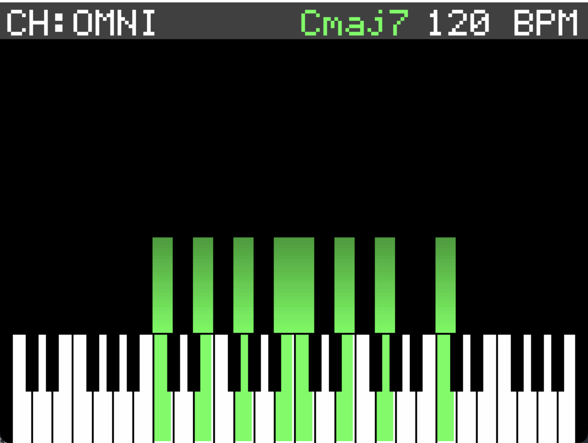
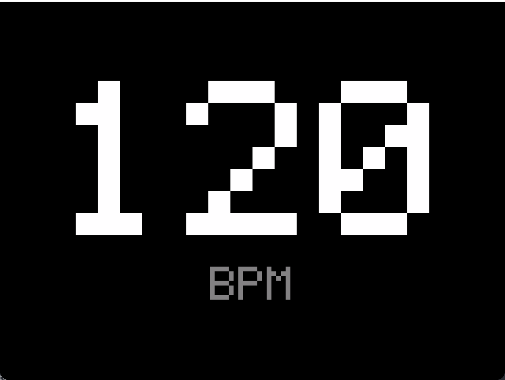
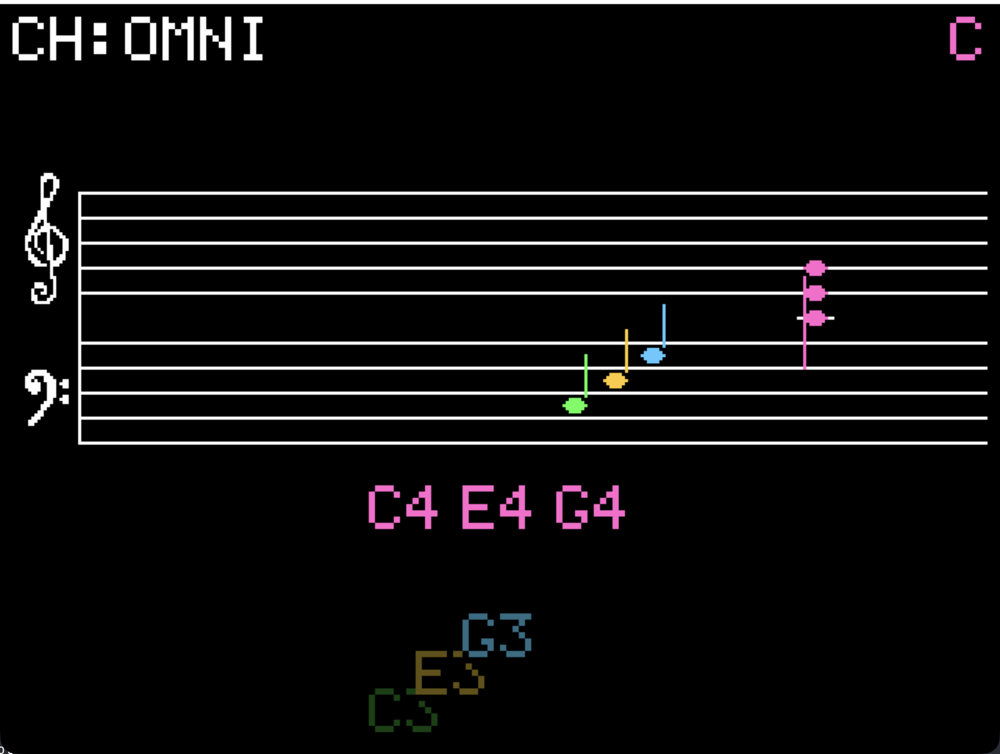

# MIDIops

A hardware MIDI **chord trigger / monitor** + MIDI Clock master, built on
a **Teensy 4.1** with a 2.8" ILI9341 SPI display, paired with a **macOS
SDL/RtMidi simulator** so the same app code can be iterated on without
flashing every change.

Identifies itself over USB as **`MIDIops`** (class-compliant MIDI). You
map any incoming note to a chord (any root, 7 chord types, gate length
in MIDI ticks, block / up / down). Triggers fire on every NoteOn, get
queued FIFO so they never overlap, and play out on a per-mapping output
channel. Three switchable views (monitor / big-BPM / notation) plus a
full mapping editor on the device — no host software needed.

```
core/                 portable C++17, no platform headers
platform/teensy/      Teensy 4.1: ILI9341_t3n + usbMIDI + PJRC Encoder
platform/host/        macOS:      SDL2        + RtMidi  + keyboard
```

## What it looks like

The simulator window is the truth — 320×240 logical pixels scaled 3× on
the desktop, byte-identical to what the Teensy renders. Screenshots
below come straight from `make sim`.

### Boot splash

A 320×240 RGB565 synthwave artwork blits over the panel for ~3 seconds,
overlaid with the firmware's git short SHA and build timestamp.

### Monitor view

The header shows the channel filter (`CH:OMNI` or `CH:1..16`), the
current BPM, and a chord-queue strip under it (`>Cmaj7 Dmaj7 …` — the
chord with `>` is the one playing right now, the rest are waiting).

Below the header, per-channel "worms" scroll up from a 4-octave piano
keyboard while incoming notes are held — bright channel colours. Notes
that MIDIops itself is **playing** (chord-engine output) are shown as
gray rectangular **outline** worms layered on top, so input vs. output
reads at a glance. The keyboard fills the lower 60 px and highlights
each pressed key with its channel colour (or gray for engine-played
keys).



### Big-BPM focus

The current MIDI Clock tempo, rendered huge. Rotate the **view
encoder** (or press `Page Up` / `Page Down` in the simulator) to cycle
here from any other view. The BPM knob still adjusts tempo while this
view is active.



### Notation view

A grand staff (treble + bass clef) with every recent note rendered as
a proper note-head + stem, scrolling from right to left. Held-note
names are listed below the staff in their channel colour; when a note
is released the name freezes its X, drifts down and fades to black.
Above the staff, the current chord name appears in the listened
channel's colour as soon as a recognisable triad / seventh is held.

The clef bitmaps are downsampled from hand-drawn pixel-art references
(see `core/notation_glyphs.h`).



### Mapping mode

Flip the latching panel switch ON to enter the chord-mapping editor.
The first state — before any note has been pressed — shows a
full-screen synthwave "PRESS A NOTE / TO MAPPING" prompt. Once an
incoming NoteOn lands, the editor opens with that note as the
trigger; rotating the encoders edits the current mapping (chord type,
gate ticks, direction) and every change auto-saves into the chord
engine. Flip the switch back OFF to leave.

## How the chord engine works

* Each mapping is `{ trigger note + channel, chord root, chord type,
  gate ticks, output channel, direction, velocity }`. Up to 16 stored.
* Chord types: **maj, min, dim, aug, 7, m7, maj7**.
* Directions: **BLOCK** (all notes at once), **UP** (ascending
  arpeggio), **DOWN** (descending arpeggio).
* Gate is per-note, in 24-PPQN MIDI ticks (1..96). Total chord time
  scales with chord size when arpeggiating.
* Incoming NoteOn → look up mapping → if engine is idle, schedule
  immediately; otherwise **enqueue FIFO**. Triggers never overlap.
* The engine echoes every NoteOn/NoteOff it sends back to the monitor
  view so the gray ghost-outline worms appear in real time.

## Quick start

### Prerequisites

Apple Silicon Mac, Homebrew under `/opt/homebrew`:

```bash
brew install platformio sdl2 rtmidi pkg-config
brew install --cask teensy        # only needed for flashing real hardware
```

PlatformIO auto-installs the Teensy toolchain and `ILI9341_t3n` /
`Encoder` libraries on the first `pio run -e teensy41`.

### Run the simulator

```bash
make sim
```

A 960×720 window opens. The process creates a virtual CoreMIDI input
port named **`MIDIops`** that any DAW or MIDI utility can route into,
and a virtual MIDI **output** port named **`MIDIops Clock`** that
broadcasts 24 PPQN clock plus the chord-engine NoteOn/NoteOff stream.

Keyboard cheatsheet (printed to stderr at startup):

| Key | What it does |
|-----|--------------|
| `A`–`G` | Inject white-key Note On/Off in octave 4 |
| `1`–`9` | Pick the channel that the next `A`–`G` press lands on |
| `←` / `→` | Channel encoder simulation (cycles OMNI..16) |
| `↑` / `↓` | BPM encoder simulation (±1 BPM) |
| `Page Up` / `Page Down` | View encoder (cycle Monitor / BigBpm / Notation) |
| `Space` | Toggle chord-mapping mode (= panel switch) |
| `F5` | Channel-SW press (restart, or cycle direction in MAP) |
| `Tab` | BPM-SW press (no-op in normal, next mapping in MAP) |
| `End` | View-SW press (reserved) |
| `Backspace` | Panic — release stuck notes |
| `Esc` | Quit |

### Build & flash the Teensy

```bash
make firmware    # build only — prints the .hex path
make flash       # build + upload via teensy_loader_cli / Teensy Loader
```

Plug the Teensy in over USB **before** running `make flash`. The build
sets `USB_MIDI_SERIAL` so the device shows up as a class-compliant MIDI
device named `MIDIops`. If macOS still shows an old USB descriptor name
after a rename, reset CoreMIDI's cache with:

```bash
sudo killall MIDIServer
```

## Hardware

| Peripheral | Pins | What it does |
|---|---|---|
| ILI9341 2.8" SPI display | 8 (RST), 9 (DC), 10 (CS), 11/12/13 (hardware SPI) | 240×320 RGB565 panel, async-DMA framebuffer |
| DFR0789 latching panel switch | 2 | Latches ON = mapping mode. LED mirrors state. |
| KY-040 #1 — channel encoder | 3 (SW), 4 (CLK), 5 (DT) | Channel filter (0=OMNI..16). SW restarts the app / cycles direction in MAP. |
| KY-040 #2 — BPM encoder | 14 (CLK), 15 (DT), 16 (SW) | MIDI Clock tempo. SW browses mappings in MAP, no-op in normal mode. |
| KY-040 #3 — view encoder | 17 (CLK), 18 (DT), 19 (SW) | Cycles Monitor / BigBpm / Notation. SW reserved. |

Pin assignment, wiring tables and an ASCII schematic live in
[`HARDWARE.md`](HARDWARE.md). A beginner-friendly step-by-step build
walkthrough is in [`ASSEMBLY.md`](ASSEMBLY.md). Both files must be
updated in the same commit as any hardware change — see the doc-sync
rule in [`CLAUDE.md`](CLAUDE.md).

## Routing MIDI from Ableton via the macOS IAC bus

1. Open **Audio MIDI Setup** → **Window → Show MIDI Studio**.
2. Double-click **IAC Driver**, tick **Device is online**, ensure at least
   one bus is listed.
3. Start the simulator (`make sim`); it announces `[RtMidi] virtual input
   port opened: "MIDIops"` on stderr.
4. In Ableton → **Preferences → Link/Tempo/MIDI → MIDI**, enable the
   **Track** output for `MIDIops` (it appears once the simulator runs).
5. On a Live MIDI track, set the MIDI output to `MIDIops` / channel 1
   (or whichever channel matches `kDefaultChannel`). Notes you play
   appear in the simulator window.

To **hear** the chord engine, route `MIDIops Clock` (input on
Ableton's side) into an instrument track and play with a sound
generator. The same port also broadcasts MIDI Clock — you can sync
Ableton's transport to it via **Preferences → Link/Tempo/MIDI →
External Sync**.

## Splash & mapping-prompt artwork

Both screens use 320×240 RGB565 bitmaps generated from PNG sources.
Drop a new file into `photos/` and regenerate:

```bash
./scripts/build_splash_image.py photos/splashscreen_03.png \
    --out core/splash_image.h --namespace splash

./scripts/build_splash_image.py photos/press_a_note_to_mapping.png \
    --out core/mapping_prompt_image.h --namespace mapping_prompt
```

153 KB per image, lives in flash via `constexpr`.

## Configuring the listened channel

```cpp
// core/MidiMonitorApp.h
static constexpr uint8_t kDefaultChannel = 0;  // 0 = OMNI, 1..16 = a channel
```

A single source of truth, used by both targets.

## Layout

```
core/                        Portable C++17 — MUST NOT include Arduino/SDL/RtMidi headers
  MidiMessage.{h,cpp}        MIDI message value type + helpers
  Display.h                  Abstract drawing surface (RGB565)
  MidiInput.h                Abstract poll() interface
  MidiOutput.h               Abstract clock master + sendNote{On,Off}
  Button.h                   Abstract on/off button
  Encoder.h                  Abstract rotary detents
  MidiMonitorApp.{h,cpp}     The app: views, worms, chord queue, mapping editor
  ChordEngine.{h,cpp}        Trigger-driven chord / arpeggio player with FIFO queue
  notation_glyphs.h          Bitmap glyphs (clefs, note head, sharp)
  splash_image.h             320×240 boot artwork (auto-generated)
  mapping_prompt_image.h     320×240 mapping-mode prompt artwork (auto-generated)

platform/
  teensy/                    Teensy 4.1 backend
    TeensyDisplay.{h,cpp}    Wraps ILI9341_t3n with async DMA
    TeensyMidiInput.{h,cpp}  Wraps usbMIDI.read()
    TeensyMidiOutput.{h,cpp} IntervalTimer-driven 24 PPQN clock + note send
    TeensyButton.{h,cpp}     Debounced INPUT_PULLUP button
    TeensyEncoder.{h,cpp}    Wraps PJRC Encoder library
    usb_names.c              Overrides USB descriptors to "MIDIops"
    main.cpp                 setup / loop
  host/                      macOS simulator backend
    SdlDisplay.{h,cpp}       RGB565 framebuffer, scaled 3×
    RtMidiInput.{h,cpp}      Virtual CoreMIDI input "MIDIops"
    RtMidiOutput.{h,cpp}     Virtual CoreMIDI output "MIDIops Clock"
    font5x7.h                Embedded ASCII bitmap font
    main.cpp                 SDL event loop

docs/screenshots/            Simulator screenshots used in this README
scripts/                     Helper bash + Python (build, version-inject, image converter)
photos/                      Personal wiring photos + artwork sources (NOT tracked)
platformio.ini               Two environments: teensy41 and native
Makefile                     Thin wrapper around pio + helpers
HARDWARE.md                  Canonical hardware reference
ASSEMBLY.md                  Beginner-friendly build walkthrough
CLAUDE.md                    Project conventions for AI assistants
```
